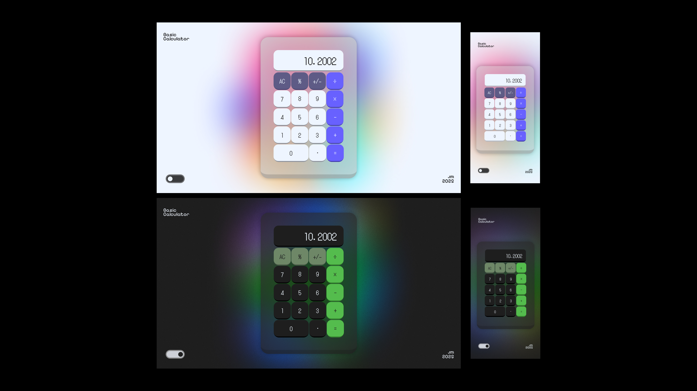

# Basic Calculator

> A simple, responsive calculator built with HTML, CSS, and JavaScript.

---

## 📖 Project Overview

This is a basic calculator web application created for practice purposes. It includes the four standard operations (addition, subtraction, multiplication, and division) and is designed with a clean, modern UI. The project helps reinforce DOM manipulation and event handling in JavaScript, as well as responsive web design using Flexbox and media queries.

> ‼️ This project is created purely for educational purposes. The layout and style are created by me on figma, and the interface is built using **placeholder design** decisions to practice front-end development.

---

## 🚀 Features

- **Basic operations**: add, subtract, multiply, divide.
- **Clear and delete functionality.**
- **Responsive layout** for mobile and desktop devices.
- **Modern UI styling** using Flexbox.

---

## 🛠️ Technologies

- **HTML5** — structure of the calculator.
- **CSS3** — layout, responsiveness, and styling.
- **JavaScript (ES6)** — logic and interaction.

---

## 📂 Repository Structure

> *Coming soon – will be updated once all files and folders are finalized.*

---

_Designed by Justin Mora._ 💚👨🏻‍💻
